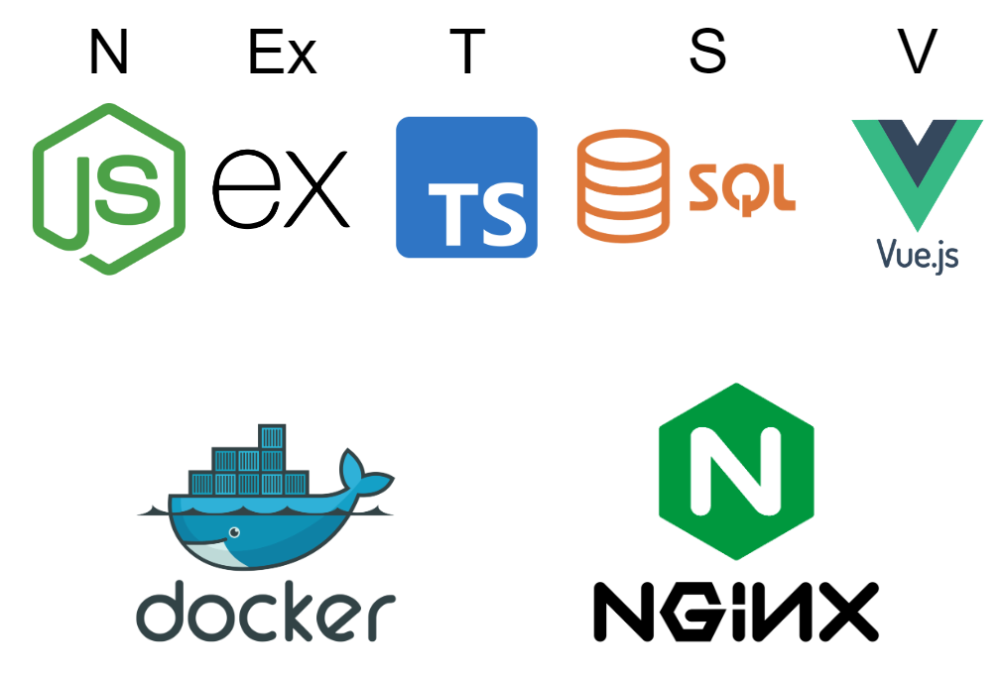
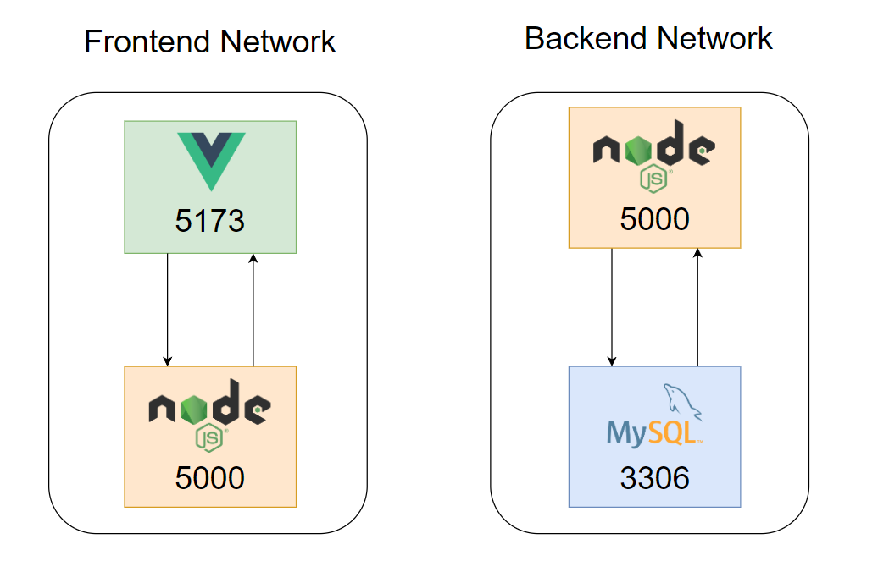
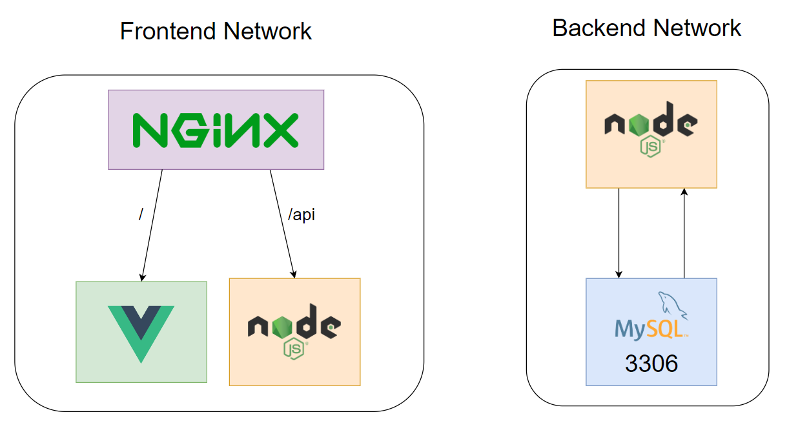

<p align="center">
  
</p>

A production ready & secure boilerplate that uses Docker & Nginx.

### Requirements
1. Docker - [Install](https://docs.docker.com/engine/install/)
2. NodeJS - [Install](https://nodejs.org/en/download/)

### Technologies Used
- VueJS (v3.4)
- Node (v16)
- Express (v4)
- MySQL (v8)
- Nginx (stable)
- Docker (latest)

### Folder Structure
```
project-root/ 
  ├── api/
  │   ├── database/
  │   ├── posts/
  │   ├── users/
  │   └── ...
  └── frontend/     
  │   ├── src/
  │   ├── nginx.conf
  │   └── ...
  ├── .env
  ├── docker-compose.yml
```

### Architecture
1. Mounted volumes for both Frontend and the Backend for ease of development.
2. Seperate & Optimized Docker files for Development and Production.

### Backend
1. Environment files have been setup separately for development and production using [Dotenv](https://www.npmjs.com/package/dotenv).
2. [Sequelize](https://www.npmjs.com/package/sequelize) is used as an object modelling framework for MySQL Database.
3. [Nodemon](https://www.npmjs.com/package/nodemon) is used to serve the Node application on the local environment for automatic reloading.

### Frontend
1. VueJS Framework used for efficiently develop user interfaces of any complexity.
2. SCSS compatible.
3. Vue-Router enabled.
4. Axios enabled and configured as an custom interceptor that can send requests to the server.

## Local Development
<p align="center">
  
</p>

- Every container has a **external port** that can be used for communicating with them externally.
- Any changes made to the codebase will automatically be reflected since the **volumes are mounted**.

1. Run the following command in both `project-root` folder:
```bash
cp .env.dist .env
```
2. Edit the .env file change container names, mysql user password and database name
3. Run the `docker compose` command or you can use Makefile Snippets:
```bash
(Linux Distro) make start
(others) docker-compose up -d
```
4. Check whether the 3 containers are running:
```
docker container ls
```
5. The Backend APIs can be triggered by hitting the following URL:
```
http://localhost:5000
```
6. The Frontend will be served on (production mode):
```
http://localhost
```
7. Start `VueJS Server` to see changes in real time
```bash
cd frontend
npm install
```
`(Linux Distro)` from root directory 
```bash
make dev
```
`(others)`
```bash
npm run dev;
```

#Production Setup
<p align="center">
  
</p>

- All the containers only have a internal port except the Frontend container which has ports `80` and `443` exposed.
- Nginx is responsible for `proxying` the requests based on the URL to either to the Frontend or the Backend containers.
- Change Servername in `nginx` config file:
```
server_name example.com www.example.com;
```
## Makefile Snippets
Start Containers
```bash
make start
```

Stop Containers
```bash
make stop
```

Build Docker Containers
```bash
make build
```

Start `VueJS` Server for watch changes (usually http://localhost:5173)
```bash
make dev
```

Build VueJS files
```bash
make build_frontend
```